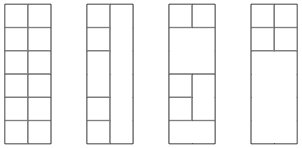

**Time limit:** 1.00 s &nbsp;&nbsp;
**Memory limit:** 512 MB

Your task is to build a tower whose width is $2$ and height is $n$. You have an unlimited supply of blocks whose width and height are integers.

For example, here are some possible solutions for $n=6$:

Given $n$, how many different towers can you build? Mirrored and rotated towers are counted separately if they look different.

**Input**

The first input line contains an integer $t$: the number of tests.

After this, there are $t$ lines, and each line contains an integer $n$: the height of the tower.

**Output**

For each test, print the number of towers modulo $10^9+7$.

**Constraints**

 - $1 \le t \le 100$
 - $1 \le n \le 10^6$

**Example**

Input: 
3 
2 
6 
1337

Output: 
8 
2864 
640403945